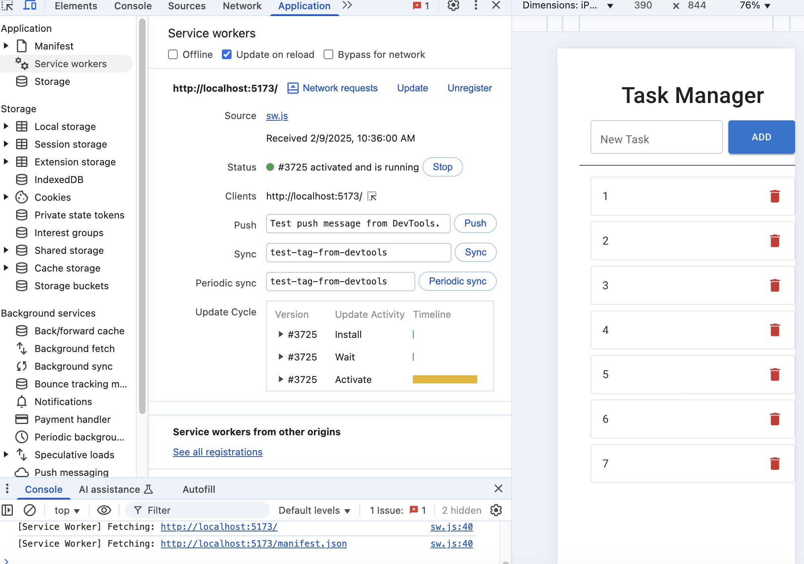
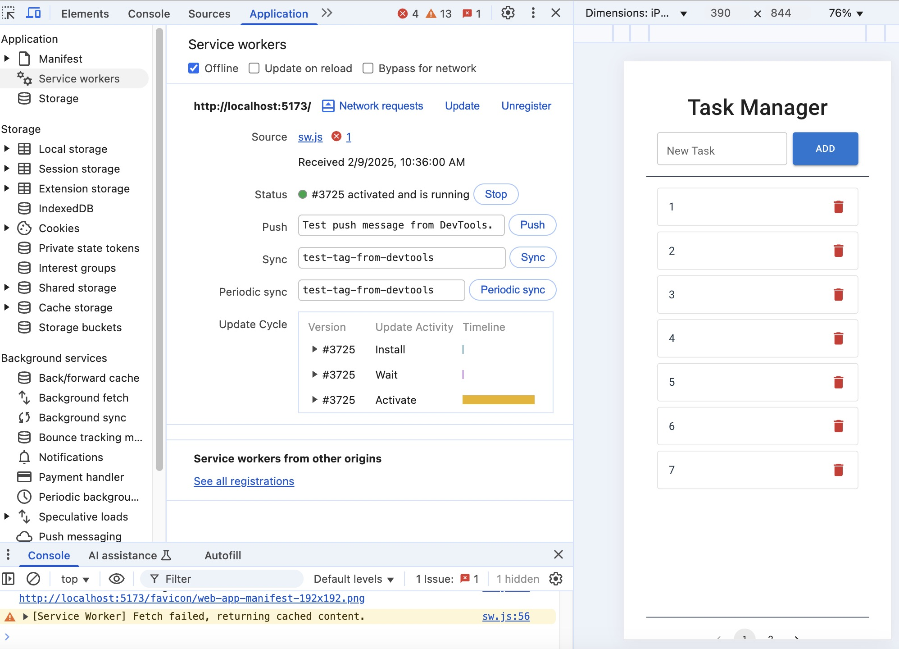
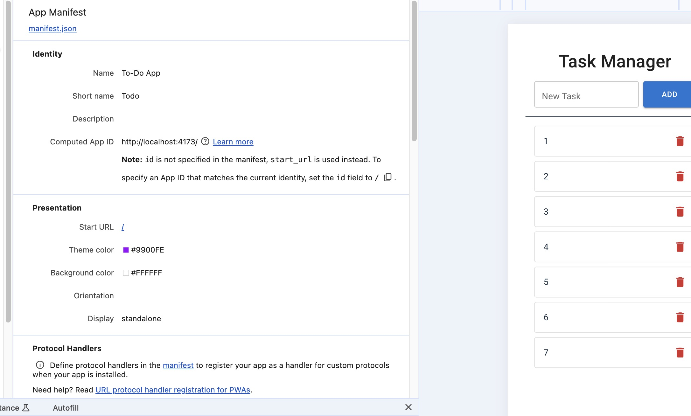
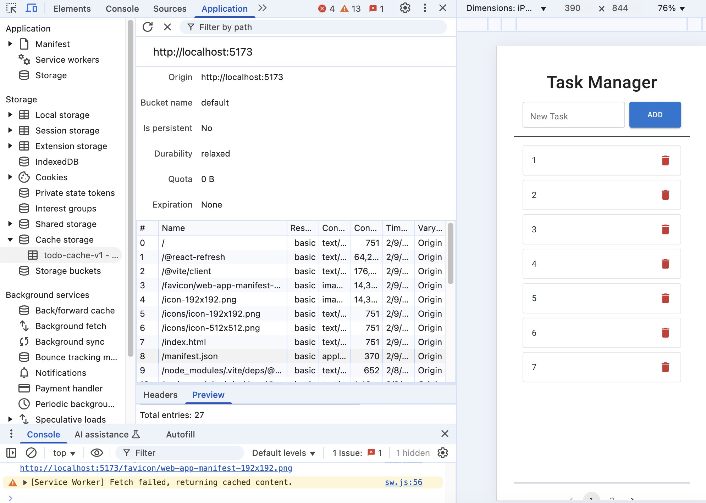

# Task Manager PWA

This is a simple Task Manager built with React, Vite, and Material UI.  
Tasks are stored in `localStorage`, and users can add, delete, and view tasks list with pagination.  
The project includes PWA support for offline usage.

## Setup Instructions

### 1. Clone the Repository
```sh
git clone https://github.com/A00488698/pwa-todo-app.git
cd pwa-todo-app
```
### 2. Install Dependencies
```sh
npm install
```
### 3. Run the Development Server
```sh
npm run dev
```
### 4. Build for Production
```sh
npm run build
```
### 5. Run Production Build Locally
```sh
npm run preview
```
### 6. Usage Instructions
1. **Add Task:** Type in the input field and press Enter or click Add.
2. **Delete Task:** Click the delete icon next to a task.
3. **Pagination:** Displays 7 tasks per page, with navigation controls.
4. **Data Persistence:** Tasks remain saved in localStorage unless cleared.
## External Dependencies
```sh
npm install @mui/material @mui/icons-material @emotion/react @emotion/styled
```
## Assumptions
1. Tasks are stored in localStorage.
2. The application does not include authentication or a backend.
3. There is only add and delete.

## Service Worker & Offline Support
This project includes a Service Worker (`sw.js`) to enable offline functionality.  
When the app is loaded, it caches the necessary resources, allowing the user to continue using the app without an internet connection.

## To Verify Offline Mode:
1. Open DevTools > `Application` > `Service Workers`.
   
2. Check `Offline` mode and refresh the page.
   
3. If the app still works, offline mode is functioning correctly.

## PWA Manifest Configuration
   

## Cache Storage
   